# Blog App 📰

Aplicativo mobile desenvolvido em **React Native + TypeScript** para criar, editar e curtir artigos. O app é simples, visualmente moderno e focado na experiência do usuário.

## 📱 Funcionalidades

- [x] Registro de novo usuário
- [x] Login
- [x] Recuperação de senha
- [x] Edição de perfil (nome, sobrenome, senha e avatar)
- [x] Criar novo artigo com imagem de capa
- [x] Editar e excluir artigos já criados
- [x] Visualizar artigos de outros usuários
- [x] Curtir artigos de outros usuários
- [x] Menu lateral com navegação entre as telas
- [x] Tela de splash personalizada
- [x] Estado de loading ao carregar dados

## 🧑‍💻 Tecnologias Utilizadas

- [React Native](https://reactnative.dev/)
- [Expo](https://expo.dev/)
- [TypeScript](https://www.typescriptlang.org/)
- [Axios](https://axios-http.com/)
- [React Navigation](https://reactnavigation.org/)
- [React Native Paper](https://callstack.github.io/react-native-paper/)
- [AsyncStorage](https://react-native-async-storage.github.io/async-storage/)
- [Expo Image Picker](https://docs.expo.dev/versions/latest/sdk/imagepicker/)

## Imagens do App

### Login
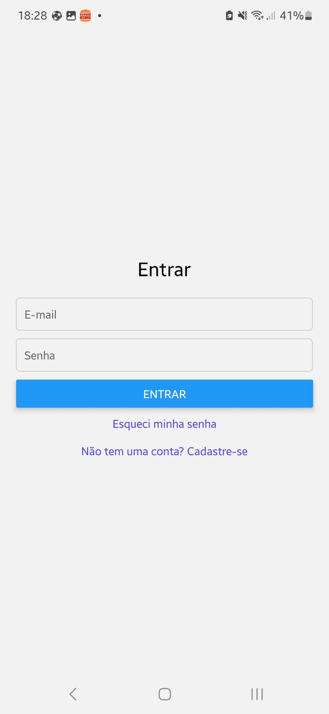

### Registro
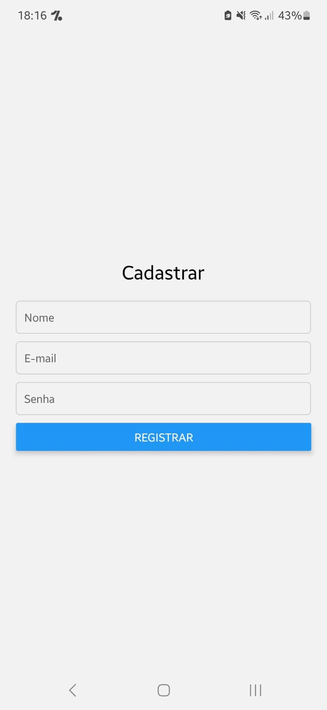

### Recuperar Senha
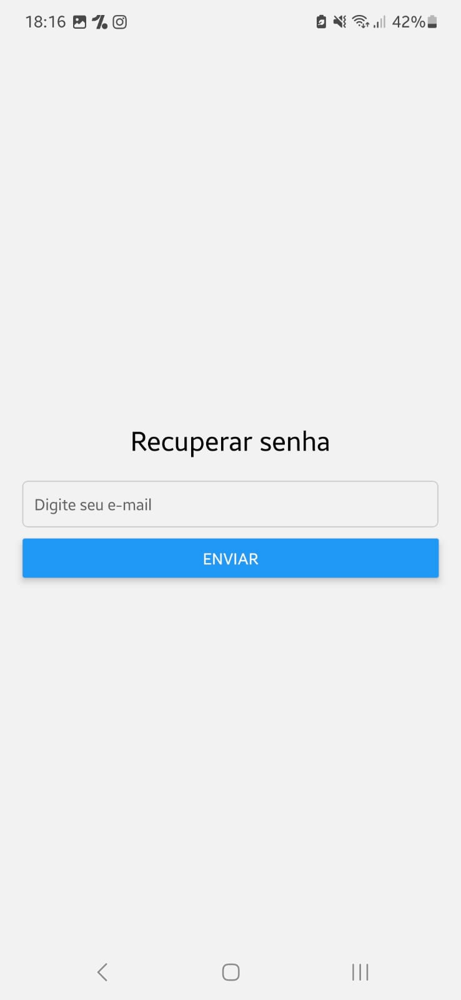

### Home
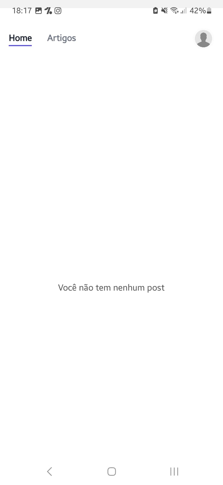

### Artigos de usuarios autenticados
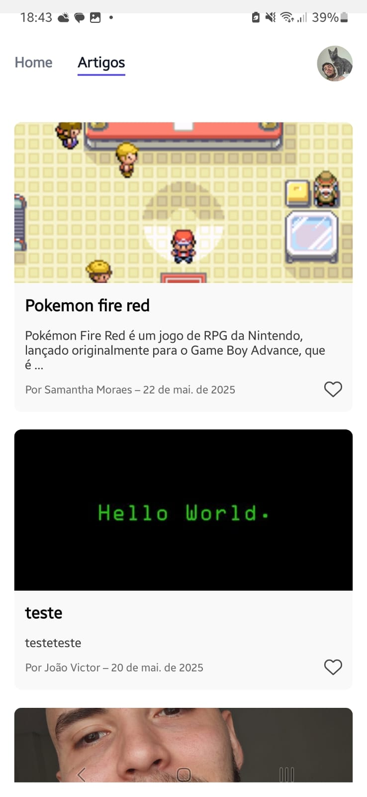

### Menu Lateral
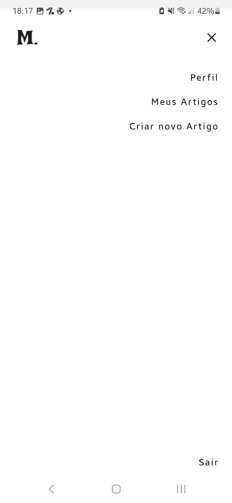


### Perfil
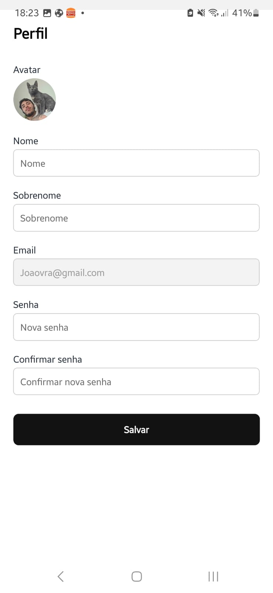

### Criar Artigo
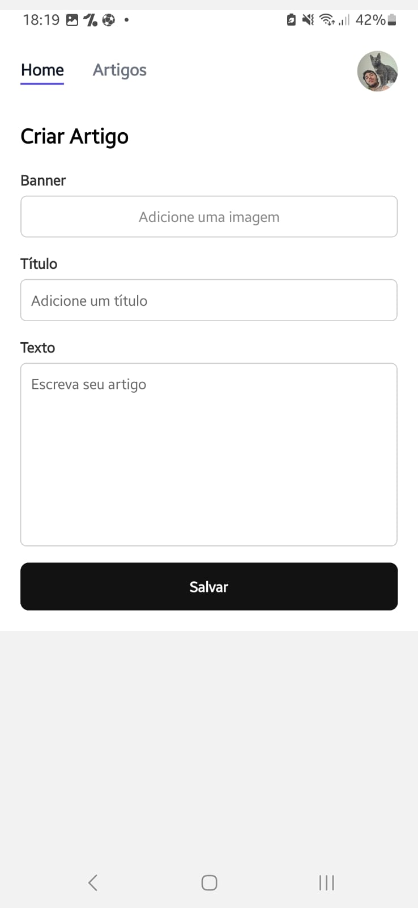

### Meus Artigos
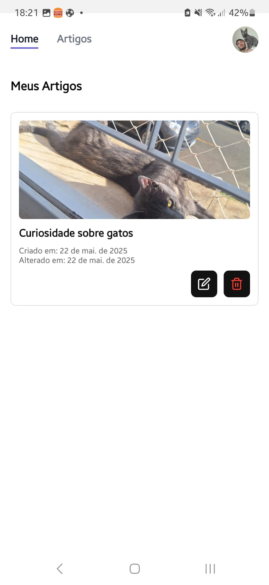

### Editar Artigo
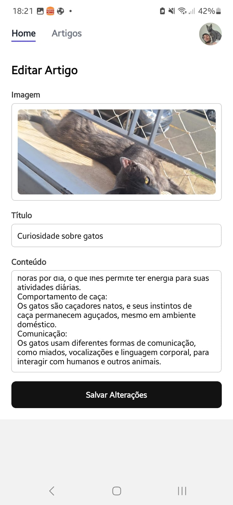

### Excluir Artigo
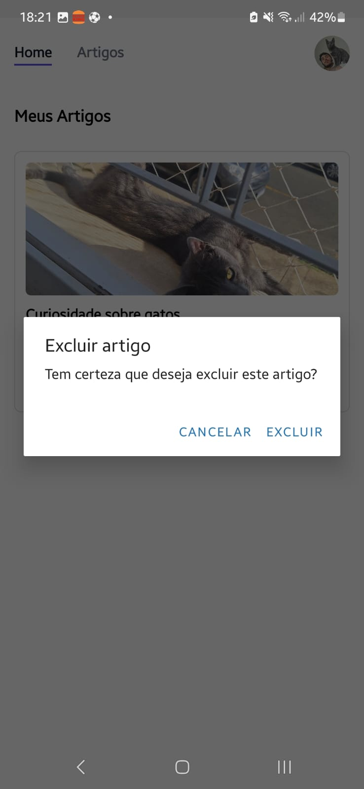

### Home com artigo
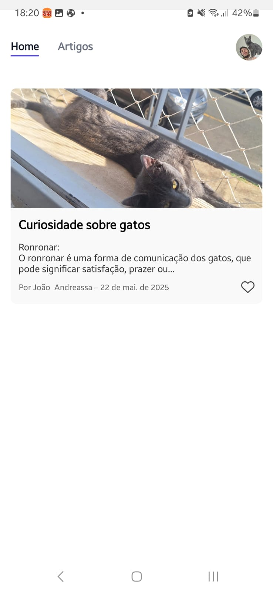


## 🚧 Observações


- O backend está em Node.js e deve estar ativo na mesma rede local.
- As imagens estão salvas no banco de dados como `BLOB` e servidas por rota protegida com token.

## 🚀 Como rodar localmente

1. Clone o repositório:

```bash
git clone https://github.com/seu-usuario/blog-app.git
cd blog-app
```

2. Instale as dependências:

```bash
npm install
```

3. Inicie o servidor local com o Expo:

```bash
npx expo start
```

4. Escaneie o QR Code com o Expo Go no seu celular.

5. O app roda localmente então crie uma pasta api, dentro um arquivo api.ts, com esse conteudo
```
import axios from 'axios';

export const api = axios.create({
  baseURL: 'http://sua ip aqui:3000', 
});

```
6. Para conseguir sua ip, rode no terminal o comando
```
ipconfig

Ele vai retornar algo como:
Endereço IPv4. . . . . . . . . . . . . : 192.111.1.11


sem isso o front não se comunica com o back
```
